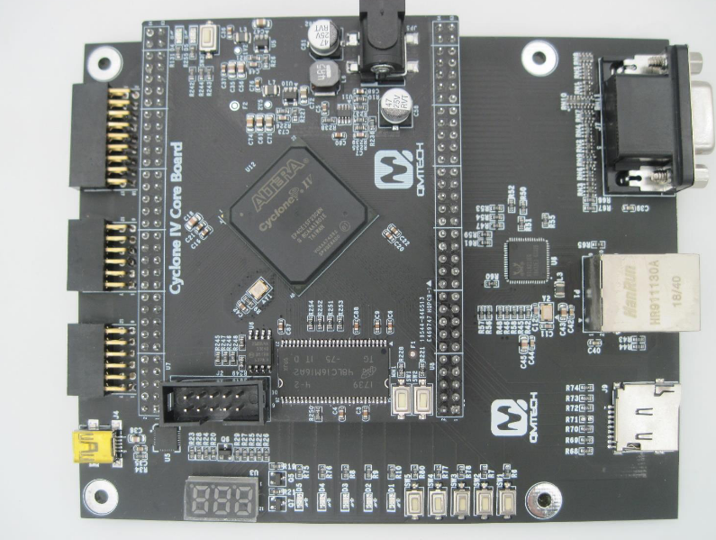

# agatf_pga
<B>- Агат-9 на ФПГА</B> 

<B>Идея:</B> 
Сделать что-то похожее на советский компьютер Агат-9.

<B>Реализация:</B> 
Сделано для "Cyclone IV E" EP4CE15F23C8 с микросхемой SDRAM W9825G6KH-6.
Порты в/в настрены для девборды: QMTech Cyclone IV EP4CE15 Core Board и платы расширения db-fpga-ep4ce15f23-v01.

<B>Что работает:</B> 
Выход VGA, разрешение 1366х768. Два контроллера гибких дисков 840Кб и 140 КБ. К каждому контролеру вместо физических приводов подключена своя SD-карта.
Одна, для АИМ образов размера 860 КБ, другая, для NIB образов размера 140 КБ(Apple ][).
PS/2 - клавиатура.

Образы записываются на карту памяти последовательно, для сшивания образов можно использовать команду, например: cat popboot.nib popa.nib popb.nib >all.bin
Для записи на карту можно использовать: dd if=all.bin of=/dev/sdХ bs=1M, где Х - ваш диск. Внимание, использование этой команды уничтожить данные на вашей карте, неправильное использование этой команды может испортить данные на ваших дисках.

Выбор номера образа кнопка "Пауза", затем кнопками 1,2,3,4 выбираем номер диска: 1,2 - 840 1,2; 3,4 - 140 1,2.
 Стрелками "вниз" и "вверх" выбираем номер образа. Смещение на диске = номер * 840кБ(или 140 КБ) / 512

<B>Что не работает:</B> 
Не реализована запись в обоих контроллерах.
Не реализованы джойстики, другие внешние контроллеры (расширение памяти, принтер, сеть, и т.д.).
На SD-картах нет поддержки FAT. 

<B>Ошибки:</B> 
Так как у меня нет реального Агата, я не знаю, что работает не так, как надо. 

<B>Пример работы:</B> 

<B>Использован код из сторонних разработок:</B> 
ЦПУ 6502: t65 (в репозитории есть несколько альтернативных реализаций);
Контроллер диска на 140 Кб, взят из проекта Apple ][ и переработан для Агата;
sd-контроллер;
sdram-контроллер, был модифицирован;
PS/2-контроллер;
Утилита dsk2nib.
