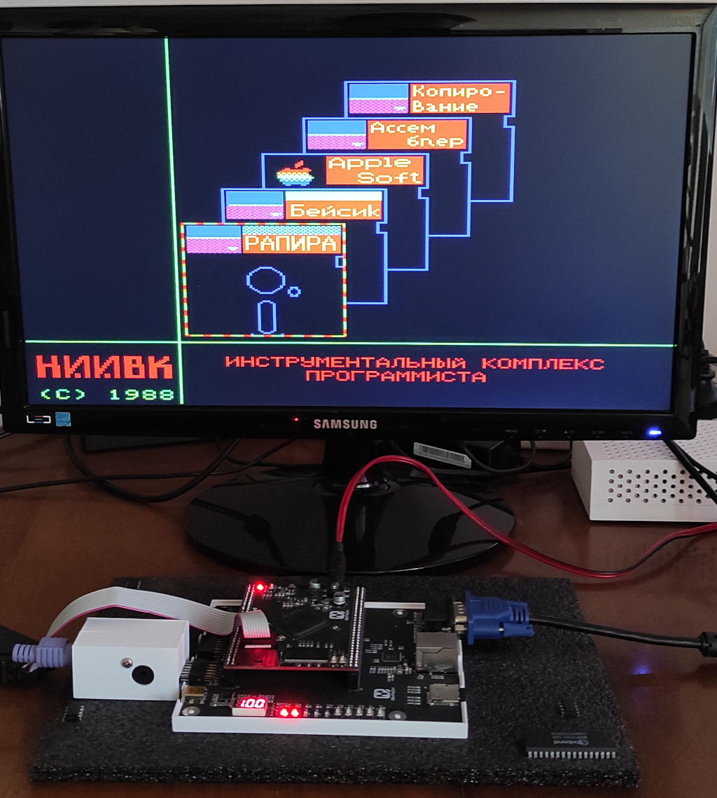

# agatf_pga
<B>- Агат-9 на ФПГА</B> 

<B>Идея:</B> 
Сделать что-то похожее на компьютер советской эпохи Агат-9.

<B>Реализация:</B> 
Сделано для "Cyclone IV E" EP4CE15F23C8.

<B>Что работает:</B> 
Выход VGA, разрешение 1366х768, 2 SD-карты.
1 для АИМ образов размера 860 КБ, 
2 для NIB образов размера 140 КБ(Apple ][),
PS/2 - клавиатура.

Образы записываются на карту памяти последовательно, для сшивания образов можно использовать команду, например: cat popboot.nib popa.nib popb.nib >all.bin
Для записи на карту можно использовать: dd if=pop.bin of=/dev/sdХ bs=1M, где Х - ваш диск. Внимание, использование этой команды уничтожить данные на вашей карте, неправильное использование этой команды может испортить данные на ваших дисках.

Выбор номера образа кнопка "Пауза", затем кнопками 1,2,3,4 выбираем номер диска: 1,2 - 840 1,2; 3,4 - 140 1,2.

<B>Что не работает:</B> 
Нет поддержки FAT. 

<B>Ошибки:</B> 
Так как у меня нет реального Агата, я не знаю, что работает не так, как надо. 

<B>Пример работы:</B> 

